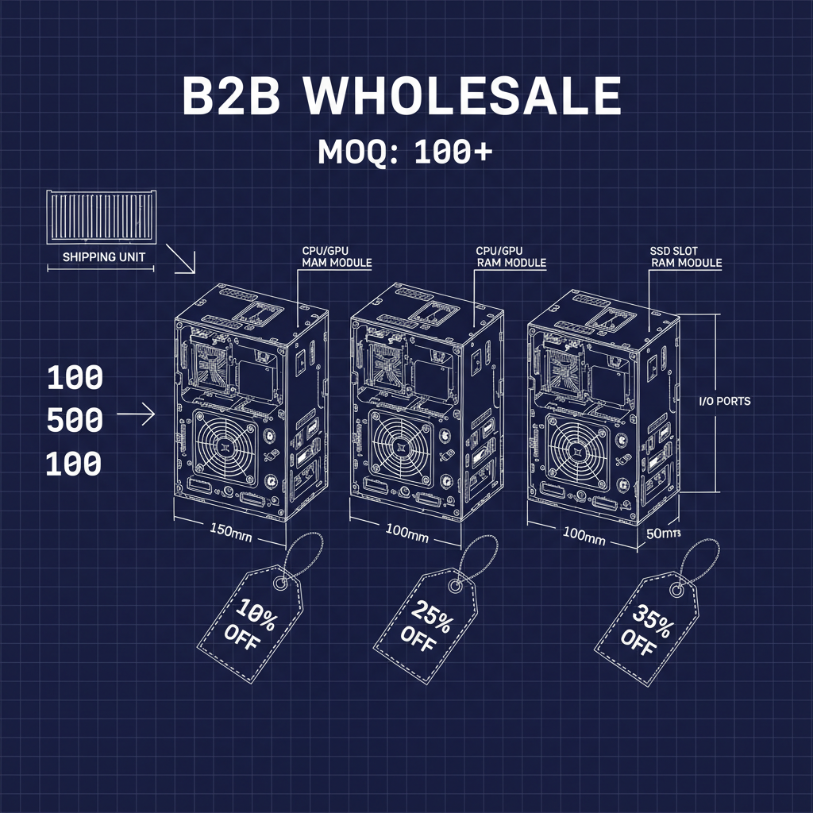
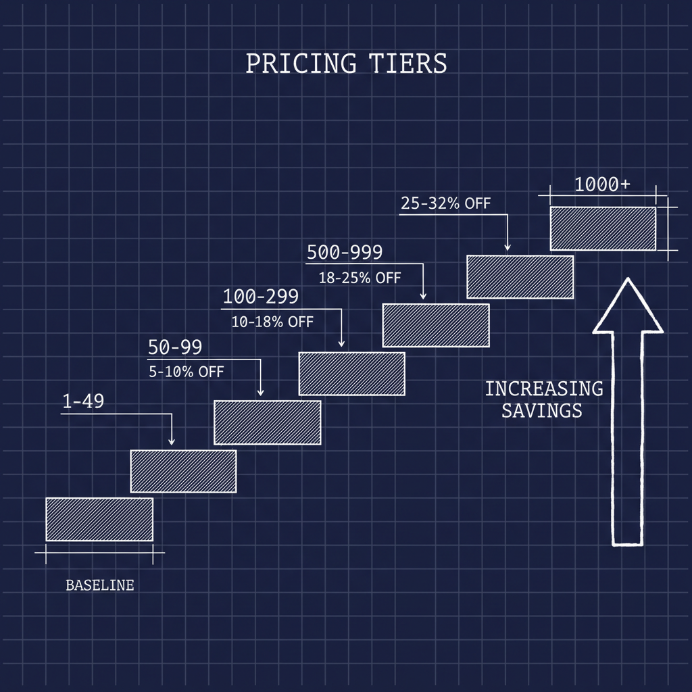
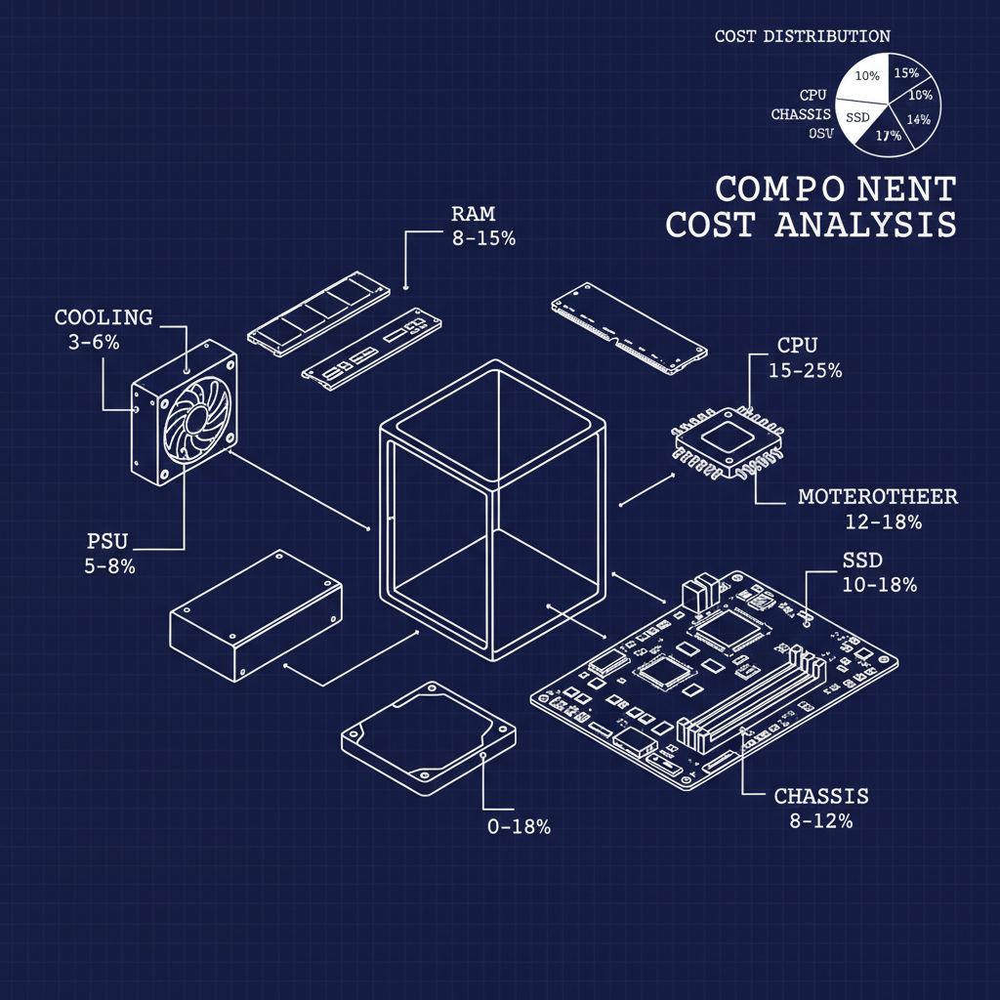
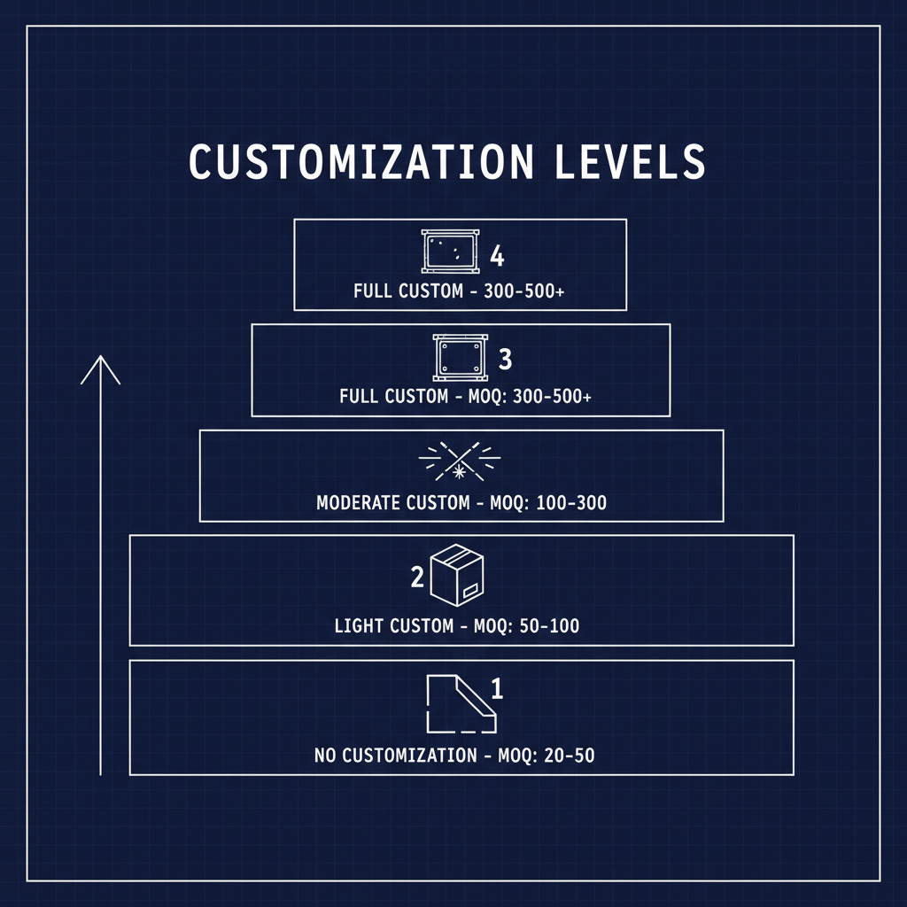
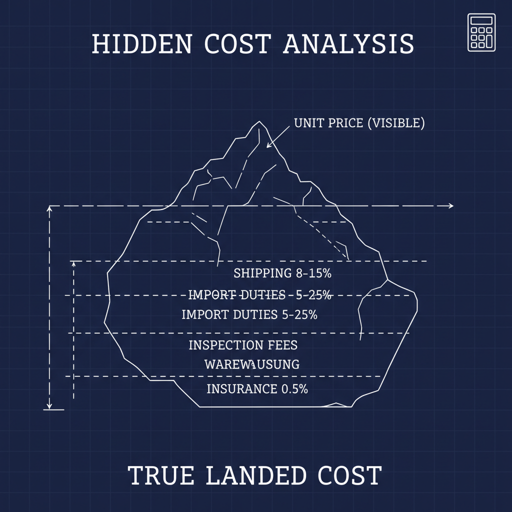
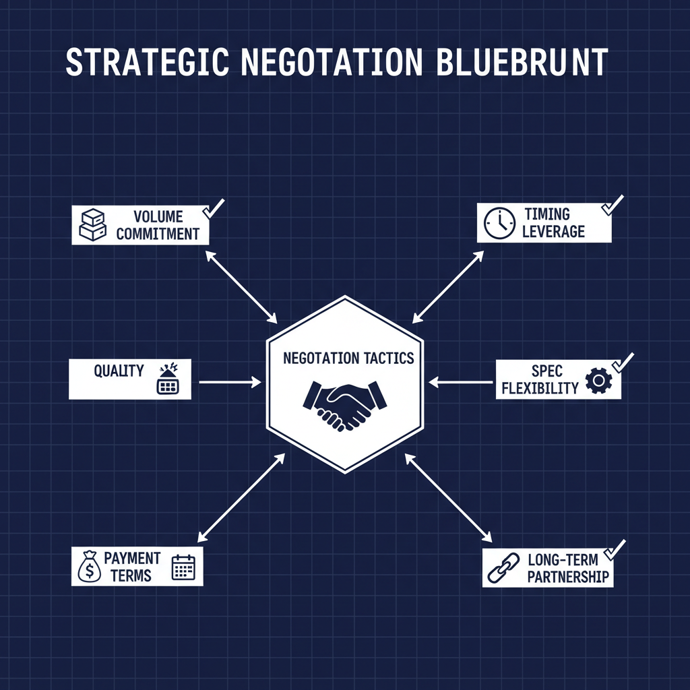
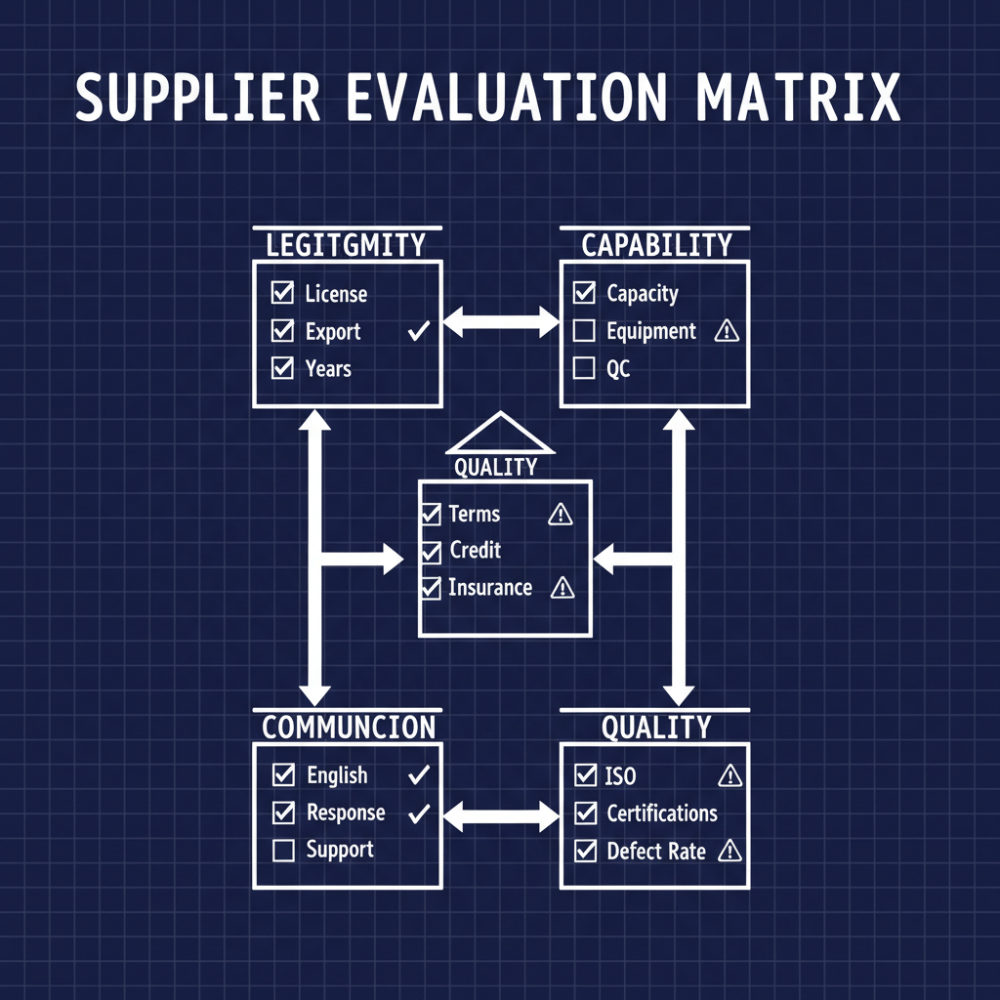
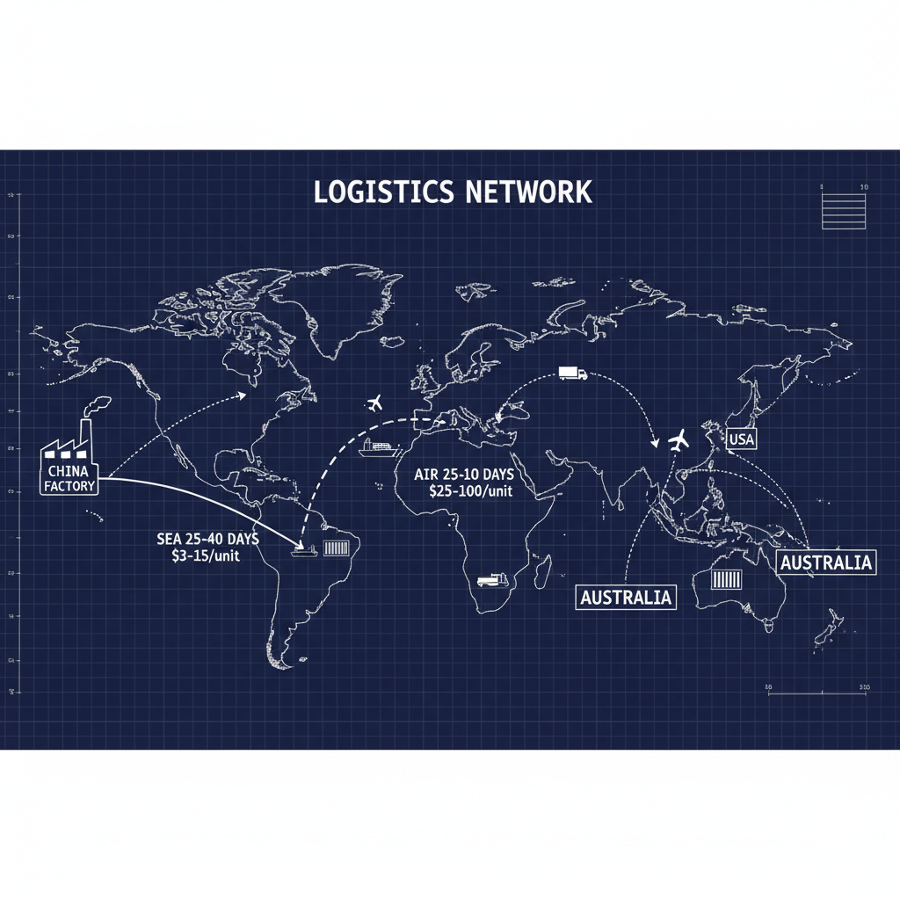

# Mini PC Wholesale: B2B Pricing & MOQ Guide 2025

**Last Updated:** January 19, 2026 | **Reading Time:** 14 minutes | **For:** Distributors, Resellers, System Integrators, Procurement Managers

---

## Introduction

Looking to source mini PCs at wholesale prices but unsure about pricing structures and MOQ requirements?

The global mini PC market reached $28.5 billion in 2024, with B2B wholesale accounting for over 60% of total shipments. For distributors, resellers, and enterprise buyers, understanding wholesale pricing dynamics is essential for maintaining healthy margins and competitive positioning.

This guide breaks down everything you need to know about mini PC wholesale: pricing tiers, MOQ expectations, negotiation strategies, and how to evaluate suppliers for long-term partnerships.

**In this guide, you'll learn:**
- Mini PC wholesale pricing structures and volume discounts
- MOQ requirements across different supplier types
- Hidden costs that affect your true landed cost
- Negotiation strategies for better pricing
- How to evaluate and select wholesale suppliers
- Payment terms and financing options
- Import considerations and logistics costs

---

## Table of Contents

1. [Understanding Mini PC Wholesale Pricing](#pricing-structure)
2. [MOQ Requirements Explained](#moq-requirements)
3. [Price Breakdown by Configuration](#price-breakdown)
4. [Hidden Costs and True Landed Cost](#hidden-costs)
5. [Negotiation Strategies](#negotiation)
6. [Supplier Evaluation Criteria](#supplier-evaluation)
7. [Payment Terms and Financing](#payment-terms)
8. [Import and Logistics Considerations](#logistics)
9. [Frequently Asked Questions](#faq)

---

## Understanding Mini PC Wholesale Pricing {#pricing-structure}

Mini PC wholesale pricing follows a tiered structure based on order volume, customization level, and supplier relationship.

### Pricing Tier Structure

| Order Volume | Discount Level | Typical Savings |
|-------------|----------------|-----------------|
| 1-49 units | Sample/Retail | Baseline price |
| 50-99 units | Small wholesale | 5-10% off |
| 100-299 units | Standard wholesale | 10-18% off |
| 300-499 units | Volume discount | 18-25% off |
| 500-999 units | Large volume | 25-32% off |
| 1000+ units | Strategic pricing | 30-40% off |

### Factors Affecting Wholesale Price

**1. Component Costs (55-70% of unit price)**

Component pricing fluctuates based on:
- Global supply chain conditions
- Currency exchange rates
- Seasonal demand patterns
- New product launches affecting older inventory

**Key components by cost impact:**
| Component | % of Total Cost | Price Volatility |
|-----------|----------------|------------------|
| CPU | 15-25% | Medium |
| RAM | 8-15% | High |
| Storage (SSD) | 10-18% | High |
| Chassis/Enclosure | 8-12% | Low |
| Power Supply | 5-8% | Low |
| Motherboard | 12-18% | Medium |
| Cooling System | 3-6% | Low |
| Connectivity (WiFi/BT) | 2-4% | Low |

**2. Manufacturing Costs (15-25%)**
- Assembly labor
- Quality control and testing
- Packaging materials
- Factory overhead

**3. Supplier Margin (10-20%)**
- Varies by supplier type
- Negotiable based on volume and relationship
- Lower for direct factory purchases

### Supplier Type Comparison

| Supplier Type | Typical Margin | MOQ | Best For |
|--------------|----------------|-----|----------|
| Direct Factory (OEM) | 10-15% | 100-500 | Large orders, customization |
| Trading Company | 15-25% | 50-200 | Smaller orders, variety |
| Distributor | 20-35% | 10-50 | Quick fulfillment, support |
| Alibaba Suppliers | 15-30% | 1-100 | Testing, small batches |

**Recommendation:** For orders over 200 units, work directly with factories to maximize margins. For smaller orders or when testing new products, trading companies offer flexibility.

---

## MOQ Requirements Explained {#moq-requirements}

Minimum Order Quantity (MOQ) varies significantly based on product type, customization level, and supplier.

### Standard MOQ by Product Category

| Mini PC Category | Standard Config MOQ | Custom Config MOQ |
|-----------------|---------------------|-------------------|
| Entry-level (N100/N200) | 50-100 units | 100-200 units |
| Mainstream (i5/Ryzen 5) | 50-100 units | 100-300 units |
| Performance (i7/i9) | 30-50 units | 100-200 units |
| Gaming Mini PC | 30-50 units | 100-300 units |
| Industrial Mini PC | 20-50 units | 50-100 units |

### MOQ by Customization Level

**Level 1: No Customization (Lowest MOQ)**
- Standard configurations
- Generic packaging
- No branding
- MOQ: 20-50 units

**Level 2: Light Customization**
- Logo sticker on chassis
- Custom packaging insert
- Pre-installed software
- MOQ: 50-100 units

**Level 3: Moderate Customization**
- Laser-engraved logo
- Custom retail box
- Modified BIOS splash
- MOQ: 100-300 units

**Level 4: Full Customization**
- Custom chassis color
- Unique form factor modifications
- Custom I/O configuration
- MOQ: 300-500+ units

### Negotiating Lower MOQ

**Strategies that work:**

1. **Start with samples, commit to volume**
   - Order 5-10 samples at retail price
   - Provide written commitment for larger order
   - Many suppliers reduce MOQ for committed buyers

2. **Accept mixed configurations**
   - Combine different specs to meet total MOQ
   - Example: 30x i5 + 30x i7 = 60 units total

3. **Flexible delivery schedule**
   - Agree to staggered delivery over 2-3 months
   - Supplier can batch production efficiently

4. **Pay premium for lower MOQ**
   - Accept 5-10% higher unit price
   - Still better than excess inventory

5. **Join group orders**
   - Some suppliers aggregate small buyers
   - Share MOQ across multiple customers

---

## Price Breakdown by Configuration {#price-breakdown}

### Entry-Level Mini PC (Intel N100/N200)

**Target market:** Digital signage, thin clients, basic office

| Component | Specification | Est. Cost |
|-----------|--------------|-----------|
| CPU | Intel N100 | $35-45 |
| RAM | 8GB DDR4 | $18-25 |
| Storage | 256GB NVMe | $20-28 |
| Chassis | Compact aluminum | $25-35 |
| Motherboard | Mini-ITX | $45-60 |
| Power | 65W adapter | $8-12 |
| Cooling | Passive/small fan | $8-15 |
| WiFi/BT | WiFi 6 module | $8-12 |
| Assembly & QC | - | $15-25 |
| **Total BOM** | - | **$182-257** |

**Wholesale pricing:**
| Volume | Unit Price | Your Margin (at $299 retail) |
|--------|-----------|------------------------------|
| 100 units | $195-220 | 26-35% |
| 300 units | $175-200 | 33-42% |
| 500 units | $160-185 | 38-47% |
| 1000 units | $145-170 | 43-52% |

### Mainstream Mini PC (Intel i5/AMD Ryzen 5)

**Target market:** Office productivity, SMB, education

| Component | Specification | Est. Cost |
|-----------|--------------|-----------|
| CPU | Intel i5-13500H | $180-220 |
| RAM | 16GB DDR5 | $45-60 |
| Storage | 512GB NVMe | $35-48 |
| Chassis | Premium aluminum | $35-50 |
| Motherboard | Custom board | $65-85 |
| Power | 120W adapter | $15-22 |
| Cooling | Dual fan system | $18-28 |
| WiFi/BT | WiFi 6E module | $12-18 |
| Assembly & QC | - | $20-30 |
| **Total BOM** | - | **$425-561** |

**Wholesale pricing:**
| Volume | Unit Price | Your Margin (at $699 retail) |
|--------|-----------|------------------------------|
| 100 units | $480-540 | 23-31% |
| 300 units | $440-500 | 28-37% |
| 500 units | $400-460 | 34-43% |
| 1000 units | $365-420 | 40-48% |

### Performance Mini PC (Intel i7/i9)

**Target market:** Power users, content creators, workstations

| Component | Specification | Est. Cost |
|-----------|--------------|-----------|
| CPU | Intel i7-13700H | $320-380 |
| RAM | 32GB DDR5 | $85-110 |
| Storage | 1TB NVMe | $65-85 |
| Chassis | Premium with RGB | $50-70 |
| Motherboard | High-end custom | $95-125 |
| Power | 180W adapter | $25-35 |
| Cooling | Advanced thermal | $35-50 |
| WiFi/BT | WiFi 6E + BT 5.3 | $15-22 |
| Assembly & QC | - | $25-35 |
| **Total BOM** | - | **$715-912** |

**Wholesale pricing:**
| Volume | Unit Price | Your Margin (at $1,199 retail) |
|--------|-----------|--------------------------------|
| 100 units | $780-880 | 27-35% |
| 300 units | $720-820 | 32-40% |
| 500 units | $660-760 | 37-45% |
| 1000 units | $600-700 | 42-50% |

---

## Hidden Costs and True Landed Cost {#hidden-costs}

Many buyers focus only on unit price, missing significant costs that affect profitability.

### Complete Cost Breakdown

**1. Product Cost (Base)**
- Unit price from supplier
- Customization fees
- Packaging costs

**2. Shipping & Logistics (8-15% of product cost)**

| Shipping Method | Cost per Unit | Transit Time |
|----------------|---------------|--------------|
| Sea freight (FCL) | $3-8 | 25-40 days |
| Sea freight (LCL) | $8-15 | 30-45 days |
| Air freight | $25-60 | 5-10 days |
| Express (DHL/FedEx) | $40-100 | 3-7 days |

**Container capacity for mini PCs:**
- 20ft container: 2,000-3,500 units
- 40ft container: 4,500-7,500 units

**3. Import Duties & Taxes (5-25%)**

| Market | Import Duty | VAT/GST |
|--------|-------------|---------|
| USA | 0% (most electronics) | None federal |
| EU | 0-4.5% | 19-27% |
| UK | 0-4.5% | 20% |
| Australia | 0-5% | 10% |
| Canada | 0% | 5-15% |

**Note:** Duties vary by HS code classification. Mini PCs typically fall under 8471.41 or 8471.49.

**4. Quality Inspection (Optional but recommended)**
- Pre-shipment inspection: $200-400 per batch
- Full container inspection: $300-600
- Third-party testing: $500-2,000

**5. Warehousing & Handling**
- Receiving and storage: $0.50-2.00 per unit/month
- Pick and pack: $1-3 per order
- Returns processing: $5-15 per unit

### True Landed Cost Calculator

**Example: 500 units of mainstream mini PC**

| Cost Category | Amount | Per Unit |
|--------------|--------|----------|
| Product cost (500 × $450) | $225,000 | $450.00 |
| Sea freight | $2,500 | $5.00 |
| Import duty (0%) | $0 | $0.00 |
| Customs clearance | $350 | $0.70 |
| Inland freight | $800 | $1.60 |
| Inspection | $400 | $0.80 |
| Insurance (0.5%) | $1,125 | $2.25 |
| **Total Landed Cost** | **$230,175** | **$460.35** |

**True margin at $699 retail:** 34.2% (vs. 35.6% on product cost alone)

---

## Negotiation Strategies {#negotiation}

### Before Negotiation: Preparation

**1. Know your numbers**
- Target landed cost
- Competitor pricing
- Volume projections (realistic)
- Payment capability

**2. Research the supplier**
- Production capacity
- Current order book
- Financial stability
- Alternative suppliers

**3. Understand their constraints**
- Component costs are largely fixed
- Labor costs vary by region
- Margin expectations by supplier type

### Effective Negotiation Tactics

**1. Volume Commitment**
- Offer annual volume commitment for better pricing
- Example: "We'll order 2,000 units over 12 months"
- Get pricing locked for the commitment period

**2. Payment Terms Trade-off**
- Faster payment = better pricing
- 100% upfront: 3-5% additional discount
- 50/50 (order/shipment): 1-2% discount
- Net 30: Standard pricing

**3. Specification Flexibility**
- Accept equivalent components
- Example: "Samsung or equivalent SSD acceptable"
- Can reduce cost 5-10%

**4. Long-term Partnership**
- First order at standard pricing
- Negotiate better terms for repeat orders
- Build relationship before pushing hard on price

**5. Timing Leverage**
- Order during slow seasons (Q1, Q3)
- End of quarter/year (suppliers need to hit targets)
- When new models launch (clear old inventory)

### What NOT to Do

❌ Demand unrealistic prices (below BOM cost)
❌ Threaten to go to competitors without intent
❌ Negotiate after order confirmation
❌ Request changes without expecting cost impact
❌ Compare factory prices to trading company quotes

### Sample Negotiation Script

> "We've evaluated several suppliers and your product quality meets our standards. Our target landed cost is $X per unit for an initial order of 300 units. We project 1,500 units annually if this partnership works well. What's the best pricing you can offer for this volume commitment with 30% deposit and 70% before shipment?"

---

## Supplier Evaluation Criteria {#supplier-evaluation}

### Essential Evaluation Checklist

**1. Business Legitimacy**
- [ ] Business license verification
- [ ] Export license (if required)
- [ ] Years in business (prefer 5+)
- [ ] Factory ownership vs. trading company
- [ ] References from existing customers

**2. Production Capability**
- [ ] Monthly production capacity
- [ ] Current capacity utilization
- [ ] Equipment age and condition
- [ ] Quality control processes
- [ ] R&D capabilities

**3. Quality Standards**
- [ ] ISO 9001 certification
- [ ] Product certifications (CE, FCC, RoHS)
- [ ] Defect rate data (<1% acceptable)
- [ ] Warranty terms and process
- [ ] Sample quality assessment

**4. Communication & Service**
- [ ] English proficiency
- [ ] Response time (<24 hours)
- [ ] Technical support capability
- [ ] After-sales service structure
- [ ] Dedicated account manager

**5. Financial Stability**
- [ ] Payment terms offered
- [ ] Credit references
- [ ] Insurance coverage
- [ ] Dispute resolution history

### Red Flags to Watch

⚠️ **Pricing too good to be true** - Below BOM cost indicates quality issues or scam

⚠️ **No factory visit allowed** - Legitimate factories welcome inspections

⚠️ **Pressure for full upfront payment** - Standard is 30% deposit

⚠️ **Vague specifications** - Quality suppliers provide detailed specs

⚠️ **No certifications** - CE/FCC are minimum requirements

⚠️ **Poor communication** - Indicates future support issues

### Supplier Verification Methods

**1. Factory Audit**
- In-person visit (best)
- Virtual factory tour
- Third-party audit (SGS, Bureau Veritas)

**2. Sample Testing**
- Order samples before bulk
- Test under real-world conditions
- Verify specifications match claims

**3. Reference Checks**
- Request customer references
- Check online reviews (Alibaba, Made-in-China)
- Industry reputation research

**4. Documentation Review**
- Business registration
- Export records
- Certification authenticity

---

## Payment Terms and Financing {#payment-terms}

### Standard Payment Structures

| Payment Term | Risk Level | When to Use |
|-------------|------------|-------------|
| 100% T/T upfront | High (buyer) | Never recommended |
| 50% deposit, 50% before ship | Medium | New suppliers |
| 30% deposit, 70% before ship | Standard | Established relationship |
| 30% deposit, 70% against B/L | Lower | Trusted suppliers |
| Letter of Credit (L/C) | Lowest | Large orders, new suppliers |
| Net 30/60 | Lowest (buyer) | Long-term partners only |

### Letter of Credit (L/C) Basics

**When to use L/C:**
- Orders over $50,000
- New supplier relationships
- High-risk regions
- Complex customization orders

**L/C costs:**
- Bank fees: 0.5-2% of order value
- Document preparation: $200-500
- Amendment fees: $50-100 each

**L/C benefits:**
- Payment only upon document compliance
- Supplier motivation to meet specs
- Bank verification of shipment

### Trade Financing Options

**1. Purchase Order Financing**
- Lender advances funds against confirmed PO
- Cost: 2-5% per month
- Good for: Cash-constrained buyers with strong orders

**2. Inventory Financing**
- Use inventory as collateral
- Cost: 1-3% per month
- Good for: Established businesses with inventory

**3. Trade Credit Insurance**
- Protects against supplier default
- Cost: 0.5-2% of order value
- Good for: Large orders, new suppliers

---

## Import and Logistics Considerations {#logistics}

### Shipping Method Selection

| Factor | Sea Freight | Air Freight |
|--------|-------------|-------------|
| Cost per unit | $3-15 | $25-100 |
| Transit time | 25-45 days | 3-10 days |
| Minimum shipment | 1 CBM / 100kg | 1 kg |
| Best for | Large orders, planned inventory | Urgent, small orders |
| Risk | Longer exposure | Lower |

### Incoterms Explained

| Term | Seller Responsibility | Buyer Responsibility |
|------|----------------------|---------------------|
| **EXW** | Product at factory | All shipping, customs |
| **FOB** | To port, loaded on ship | Sea freight, import |
| **CIF** | To destination port | Import customs, inland |
| **DDP** | Complete to buyer door | None |

**Recommendation:** FOB is most common for B2B electronics. Gives buyer control over shipping while seller handles export.

### Customs Classification

**Mini PC HS Codes:**
- 8471.41: Automatic data processing machines (most mini PCs)
- 8471.49: Other data processing machines
- 8471.50: Processing units (may apply to barebones)

**Documentation required:**
- Commercial invoice
- Packing list
- Bill of lading / Airway bill
- Certificate of origin
- Product certifications (CE, FCC)

### Logistics Cost Optimization

**1. Consolidate shipments**
- Combine orders to fill containers
- Share container with other importers (LCL)

**2. Optimize packaging**
- Reduce box size where possible
- Stack efficiently for container loading
- Balance protection vs. space

**3. Plan ahead**
- Sea freight for regular inventory
- Air freight only for emergencies
- Build 4-6 week buffer stock

**4. Use freight forwarders**
- Better rates than direct booking
- Handle customs clearance
- Provide tracking and support

---

## Frequently Asked Questions {#faq}

### What is the typical MOQ for mini PC wholesale?

Standard MOQ ranges from 50-100 units for off-the-shelf configurations. Custom branded products typically require 100-300 units minimum. Some suppliers offer lower MOQ (20-50 units) at slightly higher per-unit prices. For first orders, many suppliers are flexible if you demonstrate serious buying intent.

### How much discount can I expect for bulk orders?

Volume discounts typically follow this pattern:
- 100 units: 10-15% off retail
- 300 units: 18-25% off retail
- 500 units: 25-32% off retail
- 1000+ units: 30-40% off retail

Actual discounts depend on product category, customization level, and supplier relationship.

### Should I work with factories directly or through trading companies?

**Direct factory benefits:**
- Lower prices (10-15% savings)
- Better customization control
- Direct communication on technical issues

**Trading company benefits:**
- Lower MOQ requirements
- Product variety from multiple factories
- Easier communication (often better English)
- Consolidated shipping

For orders over 200 units with specific requirements, work directly with factories. For smaller orders or when testing products, trading companies offer more flexibility.

### What payment terms should I expect?

Standard terms for new relationships: 30% deposit upon order confirmation, 70% before shipment (T/T). As relationships develop, you may negotiate:
- 30/70 against Bill of Lading
- Net 30 terms
- Letter of Credit for large orders

Never pay 100% upfront to a new supplier.

### How do I verify a supplier is legitimate?

1. **Request business license** and verify with local authorities
2. **Check export records** through customs databases
3. **Order samples** before bulk purchase
4. **Conduct factory audit** (in-person or third-party)
5. **Request customer references** and contact them
6. **Start with small order** to test reliability

### What certifications should mini PCs have?

Essential certifications:
- **CE marking** (required for EU sales)
- **FCC certification** (required for US sales)
- **RoHS compliance** (environmental standard)

Additional valuable certifications:
- Energy Star (efficiency)
- UL listing (safety)
- ISO 9001 (quality management)

### How long does shipping take from China?

| Method | Transit Time | Best For |
|--------|-------------|----------|
| Sea freight | 25-40 days | Regular inventory |
| Air freight | 5-10 days | Urgent orders |
| Express (DHL/FedEx) | 3-7 days | Samples, small urgent |
| Rail (to Europe) | 18-25 days | Middle ground option |

Add 3-7 days for customs clearance at destination.

### What warranty terms are standard?

Standard warranty: 12 months from shipment date
- Covers manufacturing defects
- Does not cover physical damage or misuse
- Replacement or repair at supplier's option

Extended warranty (18-24 months) available at additional cost (typically 2-5% of unit price).

---

## Conclusion: Building a Profitable Mini PC Wholesale Business

Success in mini PC wholesale requires understanding the complete cost picture, building strong supplier relationships, and maintaining healthy margins through smart negotiation.

**Key takeaways:**

1. **Know your true landed cost** - Include all hidden costs in margin calculations
2. **Start small, scale up** - Test suppliers with smaller orders before committing
3. **Build relationships** - Long-term partnerships yield better pricing and terms
4. **Plan inventory carefully** - Balance stock levels against carrying costs
5. **Verify everything** - Inspect samples, audit factories, check references

### Ready to Start Sourcing Mini PCs?

AIERXUAN offers competitive wholesale pricing with:

- **Flexible MOQ** starting from 100 units
- **Volume discounts** up to 35% for large orders
- **Multiple configurations** from entry to performance tier
- **Full customization** available for branding
- **Quality certifications** (CE/FCC/RoHS/ISO)
- **Fast production** in 7-15 days

### Next Steps:

1. **[Request Wholesale Quote](/contact)** - Get volume pricing within 24 hours
2. **[Download Product Catalog](/catalog)** - View all configurations and specs
3. **[Order Samples](/samples)** - Test quality before bulk purchase
4. **[Schedule Call](/consultation)** - Discuss your specific requirements

**Contact Information:**
- Email: sales@aierxuanlaptop.com
- WhatsApp: +86 XXX XXXX XXXX
- Website: www.aierxuanlaptop.com

---

## Related Articles

- [Mini PC Buyer's Guide 2025: B2B Wholesale & Custom Solutions](/blog/mini-pc-buyers-guide-2025-b2b-wholesale-custom)
- [Best Mini PC for Gaming 2025: OEM Solutions](/blog/best-mini-pc-gaming-2025-oem-solutions)
- [OEM vs ODM Manufacturing: Complete Guide for Tech Brands 2025](/blog/oem-vs-odm-manufacturing-complete-guide-2025)
- [ODM vs OEM: Cost Analysis for Laptop Manufacturing](/blog/odm-vs-oem-cost-analysis-laptop-manufacturing)

---

**Article Information:**
- **Primary Keywords:** mini pc wholesale, mini pc bulk order, mini pc b2b pricing
- **Secondary Keywords:** mini pc moq, wholesale computer pricing, bulk mini pc supplier
- **Word Count:** ~3,100 words
- **Target Audience:** Distributors, resellers, procurement managers
- **Search Intent:** Commercial/Transactional
